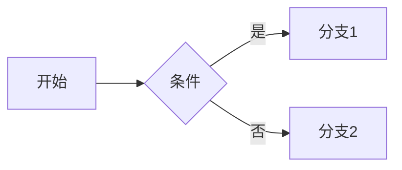

本指南帮助你充分利用 Hugo + Hextra 主题，写出视觉友好、结构清晰的高质量内容。  
<br/>

  


## 1. 必要配置

在 `hugo.yaml` 中添加以下配置以启用所有功能：

```yaml
# 启用内联短代码（icon 等需要）
enableInlineShortcodes: true

# 启用 Goldmark 不安全渲染（允许 HTML）
markup:
  goldmark:
    renderer:
      unsafe: true
  highlight:
    noClasses: false
```

## 2. Front Matter 模板

- 博客文章（content/blog/*.md）

```yaml
---
title: 标题
date: 2025-08-16
author: Edom
summary: 可选摘要（用于列表卡片/SEO）
tags: [技术, 随笔]
categories: [Go, Hugo]
series: [系列名称]
slug: 可选自定义路径
draft: false
comments: true      # 开启评论（全局允许时）
math: false         # 需要公式时改为 true
mermaid: false      # 需要流程图/时序图等时改为 true
---
```

- 文档页面（content/docs/**/*.md）

```yaml
---
title: 文档标题
type: docs
weight: 1           # 控制同级排序（越小越靠前）
prev: docs/上一页路径
next: docs/下一页路径
toc: true           # 显示目录（默认开启）
sidebar:
  open: true        # 目录默认展开
comments: false     # 文档通常关闭评论，按需开启
math: false
mermaid: false
---
```

说明：
- author 统一使用 Edom
- 博客与文档都支持 `math`（KaTeX）与 `mermaid`（Mermaid）渲染
- 文档页使用 `type: docs` 启用文档布局（带侧边栏、面包屑、分页导航）

## 3. 布局与导航结构

- 分区与列表页
  - section 列表页：`content/<section>/_index.md`（例如 blog/_index.md、docs/_index.md）
  - 单页：`content/<section>/page.md`
- 文档专用
  - 在 `content/docs/主题/_index.md` 中设置侧边栏行为（如 `sidebar.open: true`）
  - 每篇文档 `type: docs`，可设置 `prev`/`next` 形成上一页/下一页
- 顶部导航由 `hugo.yaml > menu.main` 配置
- 站点编辑按钮由 `hugo.yaml > params.editURL` 控制

## 4. 基础 Markdown 语法

### 4.1 文本格式

**语法**：
```
**粗体文本**
*斜体文本*
***粗斜体文本***
~~删除线文本~~
`行内代码`
```

**效果**：**粗体文本**、*斜体文本*、***粗斜体文本***、~~删除线文本~~、`行内代码`

### 4.2 换行与段落

**方法1：两个空格 + 回车（软换行）**
```
第一行内容
第二行内容
```

**方法2：空行分隔（段落分隔）**
```
第一段内容

第二段内容
```

**方法3：HTML 标签（强制换行）**
```
第一行内容<br>
第二行内容
```

### 4.3 分隔线

**语法**（三种方式都可以）：
```
---
***
___
```

**效果**：

---

### 4.4 标题层级

**语法**：
```
# 一级标题
## 二级标题
### 三级标题
#### 四级标题
##### 五级标题
###### 六级标题
```

### 4.5 列表

**无序列表**：
```
- 项目1
- 项目2
  - 子项目2.1
  - 子项目2.2
- 项目3

* 也可以用星号
+ 或者加号
```

**有序列表**：
```
1. 第一项
2. 第二项
   1. 子项目2.1
   2. 子项目2.2
3. 第三项
```

**任务清单**：
```
- [x] 已完成任务
- [ ] 未完成任务
- [x] 另一个已完成任务
```

**效果**：
- [x] 已完成任务
- [ ] 未完成任务
- [x] 另一个已完成任务

### 4.6 链接与图片

<!-- 链接 -->
[链接文本](https://example.com)  

[带标题的链接](https://example.com "鼠标悬停显示的标题")

<!-- 图片 -->
  


<!-- 引用式链接 -->
[链接文本][1]
[1]: https://example.com "链接标题"


### 4.7 引用

**语法**：
```
> 这是一个引用
>
> 可以多行
>
> > 嵌套引用
```

**效果**：
> 这是一个引用
>
> 可以多行
>
> > 嵌套引用

### 4.8 表格

**语法**：
```
| 左对齐 | 居中对齐 | 右对齐 |
|:-------|:--------:|-------:|
| 内容1  |   内容2   |  内容3 |
| 长内容 |   短内容   |  中等内容 |
```

**效果**：
| 左对齐 | 居中对齐 | 右对齐 |
|:-------|:--------:|-------:|
| 内容1  |   内容2   |  内容3 |
| 长内容 |   短内容   |  中等内容 |

### 4.9 脚注

**语法**：
```
这是一个带脚注的文本[^1]。

这是另一个脚注[^note]。

[^1]: 这是脚注内容
[^note]: 这是命名脚注的内容
```

**效果**：这是一个带脚注的文本[^1]。

[^1]: 这是脚注内容

## 5. 代码展示与高亮

### 5.1 代码块（带文件名）

**语法**：
```go {filename="main.go"}
package main
import "fmt"
func main(){ fmt.Println("Hello, World!") }
```


### 5.2 代码高亮行

**语法**：
```bash {hl_lines=[2,4]}
line 1
line 2 (highlight)
line 3
line 4 (highlight)
line 5
```


### 5.3 行号显示

**语法**：
```python {linenos=true}
def hello_world():
    print("Hello, World!")
    return True
```


### 5.4 代码块语言支持

常用语言标识：`bash`, `python`, `javascript`, `go`, `java`, `cpp`, `html`, `css`, `json`, `yaml`, `toml`, `sql`, `dockerfile`, `markdown`

## 6. 图片与静态资源

- 放置于 `static/images/*`，使用绝对路径引用：`/images/xxx.png`
- Hugo figure 短代码（对齐/标题等）





## 7. Hextra 专用组件与短代码

### 7.1 首页 Hero 组件
  
<!-- Hero Badge -->
</br>

  <div class="hx-w-2 hx-h-2 hx-rounded-full hx-bg-primary-400"></div>
  <span>免费开源</span>
  


 主标题 
</br>
 副标题/标语 
<br/>



  
  



### 7.2 卡片与导航


<!-- 注意：使用 Hextra 原生 cards，不是项目自定义的 hoa-cards -->

  
  
  


<!-- 双列布局示例 -->

  
  


**重要说明**：本项目中存在两套 cards 系统：
- **Hextra 原生 cards**：支持真正的网格布局（推荐使用）
- **项目自定义 hoa-cards**：主要用于特定的友链展示，不支持标准网格布局

### 7.3 提示框（Callout）


默认提示框，支持 emoji 和 **Markdown**。



信息提示框



警告提示框



错误提示框



### 7.4 步骤指南

{}

### 第一步

这是第一步。

### 第二步

这是第二步。

{}

### 7.5 标签页（Tabs）



  
  ```json
  { "hello": "world" }
  ```
  

  
  ```yaml
  hello: world
  ```
  

  
  ```toml
  hello = "world"
  ```
  



### 7.6 可折叠内容

{}

这是可折叠的内容。

支持 **Markdown** 格式。

{}


### 7.7 图标与徽章

- 图标（需要在 `hugo.yaml` 中设置 `enableInlineShortcodes: true`）





- 徽章









### 7.8 文件树

- Hextra 内置文件树


  
    
    
      
    
  
  



- 本仓库自定义文件树（支持批量下载）



  
    
  



### 6.9 多媒体嵌入


<!-- PDF 嵌入 -->


<!-- YouTube 视频 -->



### 7.10 本仓库自定义组件


<!-- 自定义 Hero 容器 -->

你好哇


<!-- 更新信息 -->



### 7.11 评论系统配置

- 全站开关：`hugo.yaml > params.comments.enable`
- 单页可用 `comments: true/false` 覆盖
- Giscus 需在 `params.comments.giscus` 提供 repo 等配置
- Cusdis 需在 `params.comments.cusdis` 提供配置

## 8. 交互增强（KaTeX / Mermaid / 搜索 / 代码复制）

- 公式（KaTeX）
  - 在页面 Front Matter 设置 `math: true`
  - 在文中使用 `$...$` 或 `$$...$$`


行内公式示例：$E = mc^2$

块级公式：
$$
\int_a^b f(x)\,dx = F(b) - F(a)
$$


- 流程图/时序图（Mermaid）
  - 一般通过代码块语言标记 `mermaid` 即可；若未生效，在页面 Front Matter 增加 `mermaid: true`





- 搜索
  - 默认启用 FlexSearch，无需额外写作操作

- 代码复制按钮
  - 主题已内置，无需额外配置

## 9. 博客写作最佳实践

- 元信息完整：`title/date/author (Edom)/tags/categories/series/summary`
- 段落层次清晰：主旨-小结-列表/代码/图示
- 长文分节 + 目录（开启 `toc: true`）
- 插图统一放在 `/images/blog/*`；命名含语义
- 系列文章使用 `series` 归档，结尾添加“下一篇/上一篇”链接（或在 Front Matter 配置）
- 评论只对需要互动的文章开启

## 10. 文档写作最佳实践

- 结构先行：将主题拆分为目录（`content/docs/<topic>/_index.md`）
- 每页一个明确主题；控制标题层级（H2 为章节主标题）
- 使用卡片/列表导航入口（`cards/card`）
- 善用 `prev/next` 形成教程流
- 需要公式与图示的教程页开启 `math/mermaid`
- 附件/大纲/资源清单可用文件树短代码（`hoa-filetree/*`）

## 11. 常见问题与解决

- 本地预览资源路径异常
  - 启动时加：`--baseURL http://localhost:1313/`
- icon shortcode 不工作
  - 在 `hugo.yaml` 中添加 `enableInlineShortcodes: true`
- **cards 布局显示为上下排列而非左右**
  - 确保使用 Hextra 原生的 `` 而非项目自定义的 `hoa-cards`
  - Hextra 原生 cards 支持 `cols` 参数控制列数
  - 项目自定义的 `hoa-cards` 主要用于友链展示，不支持标准网格布局
- 公式不渲染
  - 页内 `math: true`；避免在代码块中写 `$...$`
- Mermaid 不渲染
  - 使用 ` ```mermaid` 代码块；必要时 `mermaid: true`
- 图片 404
  - 图片放在 `static/images/*`，用 `/images/...` 引用
- 代码高亮无效
  - 确认使用正确语言标记；需要高亮行时用 `{hl_lines=[...]}`
- 侧边栏不显示/未展开
  - 文档页 `type: docs`；目录页 `_index.md` 中 `sidebar.open: true`
- 编辑此页按钮未出现
  - `hugo.yaml > params.editURL.enable/base` 是否已配置为你的仓库
- shortcodes 不渲染
  - 检查语法是否正确，注意 `` 与 `{}` 的区别
  - 某些 shortcodes（如 steps、details）需要使用 `{}` 语法

## 12. 参考示例（取自本仓库）

- 首页 Hero/Feature 组件：见 `content/_index.md`
- 文档入口卡片：见 `content/docs/_index.md`
- 文档目录展开：见 `content/docs/folder/_index.md`
- 文件树组件：见 `content/docs/folder/Resource.md`

---

如需扩展样式/交互：可在 `layouts/partials/head.html` 注入 CSS/JS，或在 `assets/js/*` 中新增脚本并通过 `layouts/partials/scripts.html` 管理加载。主题升级可运行 `hugo mod get -u && hugo mod tidy`。
